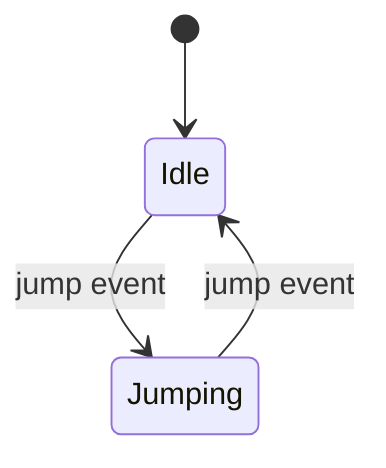

# GameLovers Statechart

Hierarchical statecharts for Unity 6 with nested and parallel regions, event transitions, choices, and async waits.

[](https://unity.com/download)
[](LICENSE.md)

## When to use it

Use Statechart when a flat FSM cannot express hierarchical behavior, concurrent regions, or controlled async waits clearly. The package is pipeline-neutral and requires UniTask for its `UniTask` wait overloads.

## Unity compatibility

| Item | Current policy |
| --- | --- |
| Minimum Unity version | `6000.0` |
| Reference streams | `6000.0.x`, `6000.3.x`, `6000.5.x` |
| Reference editors | `6000.0.81f1`, `6000.3.21f1`, `6000.5.7f1` (primary) |
| Render pipeline | Pipeline-neutral |
| Validation status | Compatibility target; consult fresh matrix artifacts before claiming validation. |

## Install

Add UniTask explicitly when installing from Git:

```json
{
  "dependencies": {
    "com.cysharp.unitask": "https://github.com/Cysharp/UniTask.git?path=src/UniTask/Assets/Plugins/UniTask#2.5.10",
    "com.gamelovers.statechart": "https://github.com/CoderGamester/Statechart-HFSM.git#0.9.5"
  }
}
```

## First success

Keep events as fields: statechart event identity is by object instance, not by its display name.

```csharp
using GameLovers.StatechartMachine;
using UnityEngine;

public sealed class PlayerStatechart : MonoBehaviour
{
    private readonly StatechartEvent jump = new("Jump");
    private Statechart chart;

    private void Awake()
    {
        chart = new Statechart(factory =>
        {
            var initial = factory.Initial("Initial");
            var idle = factory.State("Idle");
            var jumping = factory.State("Jumping");
            initial.Transition().Target(idle);
            idle.Event(jump).Target(jumping);
            jumping.Event(jump).Target(idle);
        });
        chart.Run();
    }

    public void Jump() => chart.Trigger(jump);
}
```



## Runtime semantics

| Concept | Behavior |
| --- | --- |
| `Trigger` | Ignored until `Run()` and while the chart is paused |
| `Choice` | Takes the first true transition; define a fallback deliberately |
| Action-only transition | Valid when it has no target and exists for its action |
| `Wait` | Resumes when its wait activity completes; can receive configured events |
| `TaskWait` | Waits on a `Task` or `UniTask`; it does not receive events while waiting |
| `Nest` / `Split` | Create sequential nested regions / concurrent regions |

Missing top-level initial configuration is rejected in all builds. Other setup validation has build-dependent editor/debug behavior; write and test the behavior you require instead of relying on broad “all invalid graphs fail immediately” assumptions.

## Recipes and support

The public API supports `Nest`, `Split`, `Choice`, `Wait`, and `TaskWait`; add a small package sample before treating any recipe as a supported end-to-end workflow. Until then, use the source tests as the executable reference.

See [CHANGELOG.md](CHANGELOG.md) and file an [issue](https://github.com/CoderGamester/Statechart-HFSM/issues). `AGENTS.md` is contributor guidance, not end-user API documentation.
